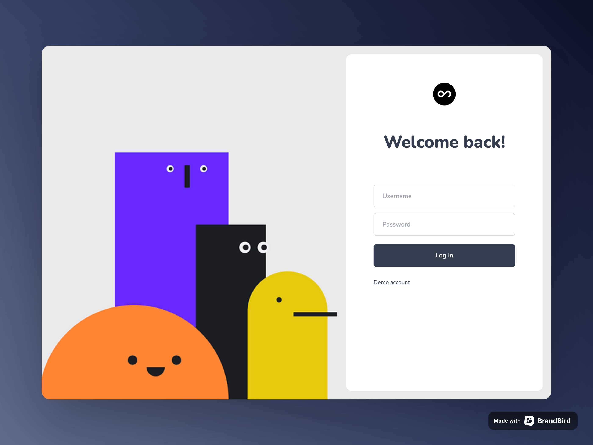
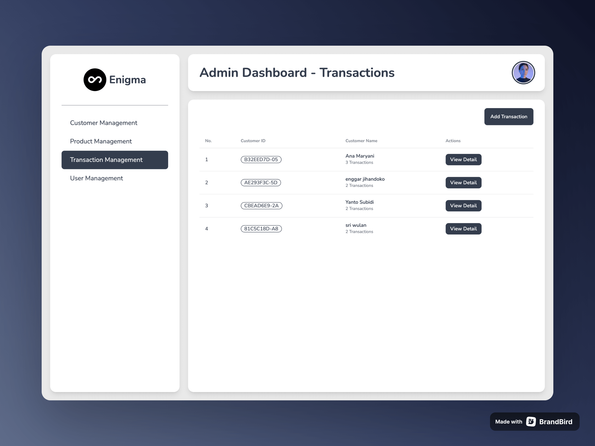
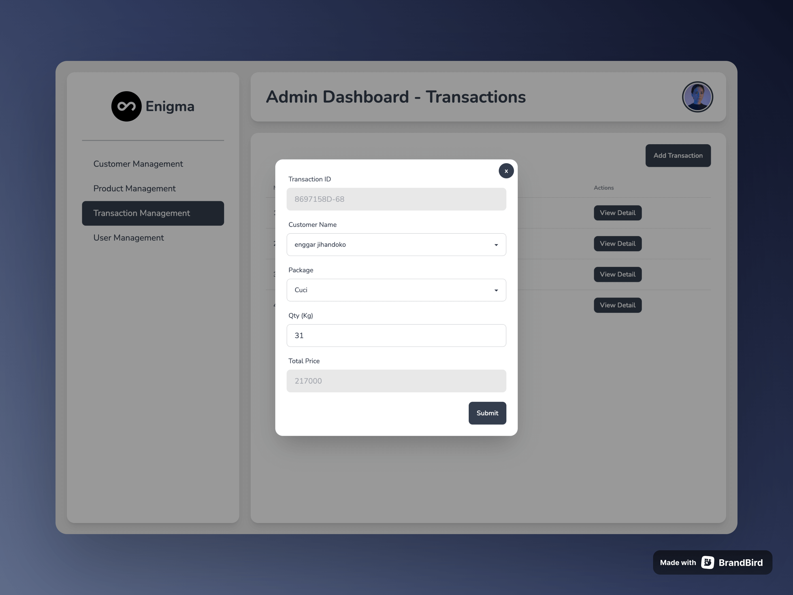
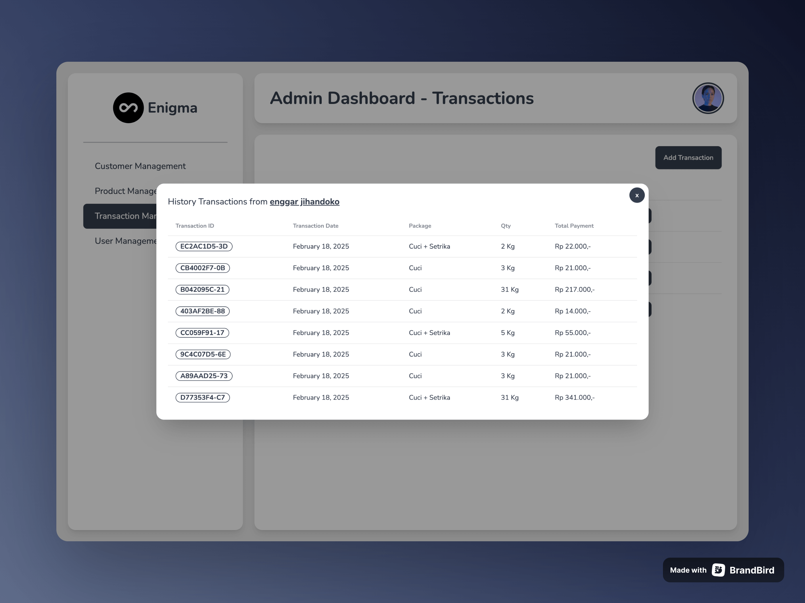

# Enigma - Laundry App

## Screenshots






## Run Locally

You need to download the API and run locally in your machine from this repo:

https://github.com/jutionck/enigma-laundry-app-with-slice

Extract it, then make new `.env` file.

Copy the content from `.env.example` to your new `.env` file.

There are 3 API files for each operating system.

If you use macos then run this on your terminal, make sure `cd` to the api directory first.

```bash
  ./enigma-laundry-app-macos
```

Then you can start cloning this project.

```bash
  git clone https://git.enigmacamp.com/enigma-20/enggar-jihandoko/challenge-react-laundry.git
```

Go to the project directory

```bash
  cd challenge-react-laundry
```

Install dependencies

```bash
  npm install
```

Start the server

```bash
  npm run dev
```

## Techs

**Client:**

-   Vite
-   Tailwind CSS
-   react-router-dom
-   daisyui
-   useReducer & useContext api

**Server:**

https://github.com/jutionck/enigma-laundry-app-with-slice
